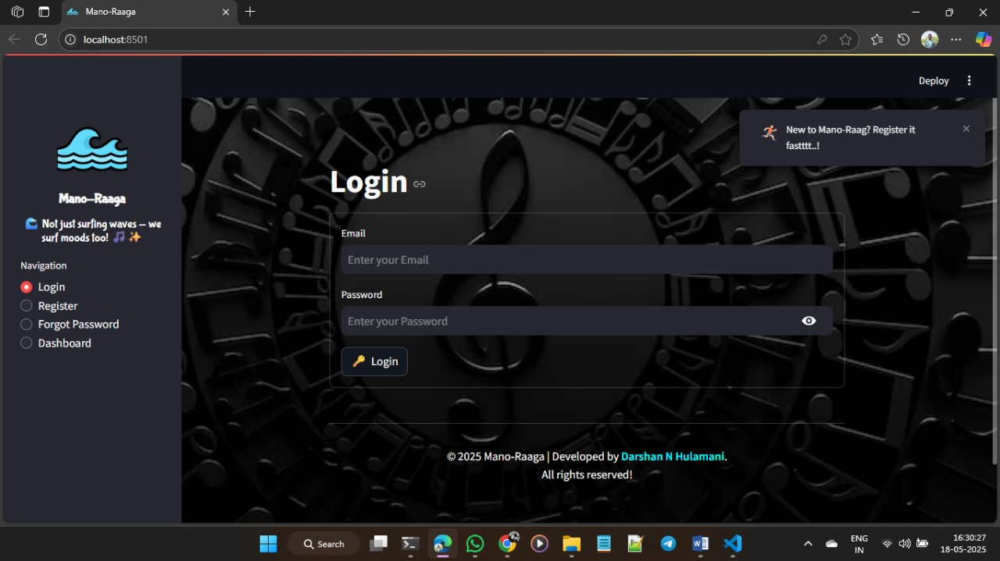
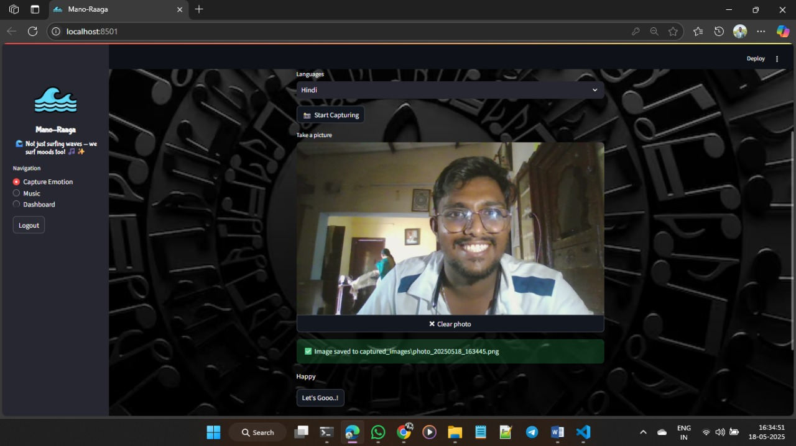
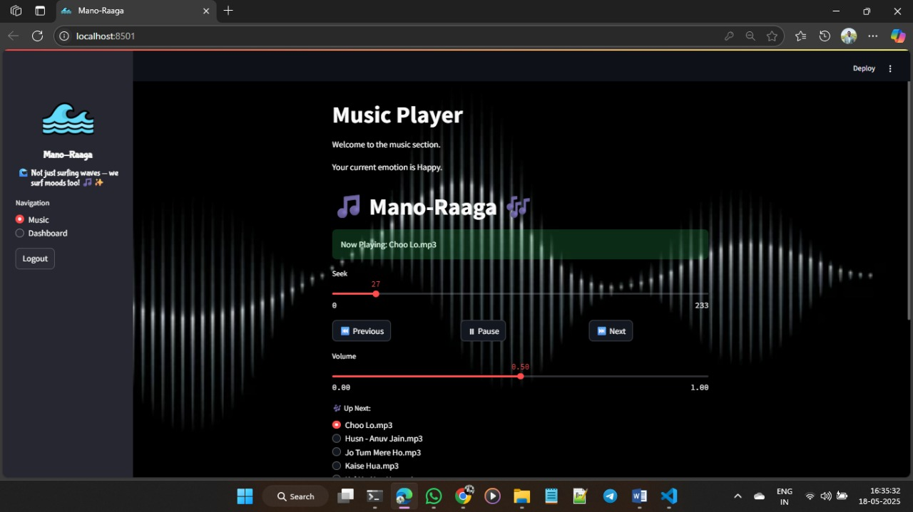

# 🎶 Mano-Raaga – Emotion Recognition Music Player
Mano-Raaga is an intelligent music player that recommends songs based on your facial expressions. Using computer vision and machine learning, it detects your current mood and plays tracks that match it — creating a personalized listening experience every time.

✨ Features
---
🎭 Real-Time Emotion Detection – Uses your webcam and OpenCV to classify facial expressions (happy, sad, neutral, etc.).

🎵 Mood-Based Song Recommendations – Fetches songs from a MySQL database based on the detected emotion.

🌐 Multi-Language Support – Choose your preferred language for recommendations.

🔐 User Authentication – Secure login and registration for a personalized experience.

⚡ Interactive Interface – Built with Streamlit, HTML, CSS, and JavaScript for a smooth and modern UI.

🛠 Tech Stack
---
Python | OpenCV | MySQL | HTML | CSS | JavaScript | Streamlit

📸 Screenshots
---
1️⃣ Login Page

2️⃣ Emotion Detection

3️⃣ Song Recommendations

---
